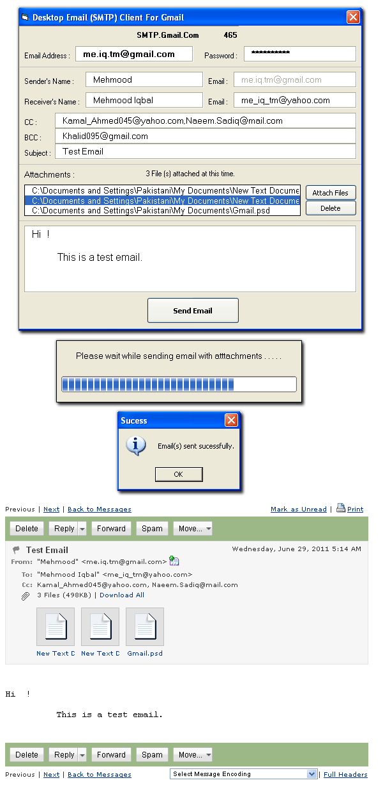



## Desktop Email \(SMTP\) Client  for Gmail

### Description

On some requests when origional project uploaded on PSC with the name of 'Urdu Desktop (SMTP) Email Client for Gmail', Some users requested to get the english version of the same project then it is converted by me to english & being uploaded on Planet Source Code. There is a desktop email client to send email using gmail address via MS CDO . No need to go on Gmail's website & login to send emails. Simply put you Gmail address & Password & send email with the (n) number of atachments. No size limit to attach files with email. All files with large size will be easily sent by this desktop client. CC & BCC function also support you to send emails with large attachments, to (n) number of receivers. Gmail's SMTP address & port fixed in this client. Keep in mind that this email client only designed to work with Gmail. No other email service provider checked with this email client and that may take errors, if you try to do that. This project may need more attention but at the start, i think it is enough to use. Please give feedback & suggestions to make this project more useful. Thank You.
 
### More Info
 

             |
---                |---
**Submitted On**   |2011-07-15 18:06:16
**By**             |[Mehmood Iqbal](https://github.com/Planet-Source-Code/PSCIndex/blob/master/ByAuthor/mehmood-iqbal.md)
**Level**          |Intermediate
**User Rating**    |4.5 (27 globes from 6 users)
**Compatibility**  |VB 6\.0
**Category**       |[Complete Applications](https://github.com/Planet-Source-Code/PSCIndex/blob/master/ByCategory/complete-applications__1-27.md)
**World**          |[Visual Basic](https://github.com/Planet-Source-Code/PSCIndex/blob/master/ByWorld/visual-basic.md)
**Archive File**   |[Desktop\_Em2208267162011\.zip](https://github.com/Planet-Source-Code/mehmood-iqbal-desktop-email-smtp-client-for-gmail__1-73980/archive/master.zip)

